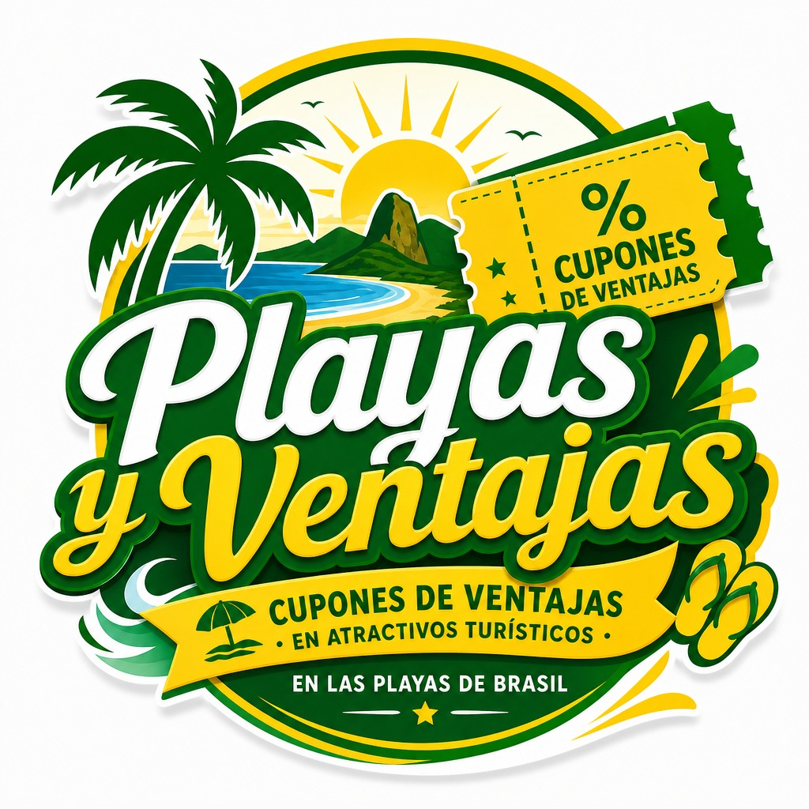

# MATERIAL DIDÁTICO - PLAYAS Y VENTAJAS 2.0
> Manual prático para utilização do sistema, voltado para quem vai usar no dia a dia.

## CAPA
**PLAYAS Y VENTAJAS 2.0**

Sistema de Cupons, Benefícios e Experiências

{ width=280 }

## SUMÁRIO

1. [O QUE É O PLAYAS Y VENTAJAS](#1-o-que-é-o-playas-y-ventajas)
2. [COMO ACESSAR O SISTEMA](#2-como-acessar-o-sistema)
3. [PARTE 1 - CLIENTE](#3-parte-1---cliente)
4. [PARTE 2 - EMPRESA](#4-parte-2---empresa)
5. [PARTE 3 - ADMINISTRADOR](#5-parte-3---administrador)
6. [PARTE 4 - MOTORISTA](#6-parte-4---motorista)
7. [DÚVIDAS FREQUENTES](#7-dúvidas-frequentes)

---

## 1. O QUE É O PLAYAS Y VENTAJAS

O **Playas y Ventajas** é uma plataforma de cupons e benefícios entre empresas e clientes. As empresas criam ofertas (cupons) e os clientes resgatam para utilizar no local.

**Principais recursos:**
- Ofertas com filtro por cidade, categoria e distância ('Perto de mim')
- Resgate de cupom com QR Code
- Meus Cupons (armazenados localmente no celular)
- Validador de cupons para a empresa (confirmação no balcão)
- Módulo de indicações (link de afiliado)
- Translado/Reservas (quando habilitado)

---

## 2. COMO ACESSAR O SISTEMA

Acesse pelo navegador do seu celular ou computador:

- **Cliente:** /cliente`r
- **Empresa:** /empresa`r
- **Administrador:** /admin`r
- **Motorista:** /motorista`r

Ao abrir /cliente, você é redirecionado automaticamente para a tela de ofertas.

---

## 3. PARTE 1 - CLIENTE

### 3.1 Tela Inicial - Ofertas
Ao entrar em /cliente, você vê as **Ofertas Disponíveis**.

**O que você pode fazer:**
1. **Filtrar por Cidade** - Selecione sua cidade para ver ofertas próximas.
2. **Filtrar por Categoria** - Escolha o tipo de negócio (Restaurante, Passeio, etc.)
3. **Perto de mim** - Toque nesse botão para ver ofertas próximas à sua localização. O raio padrão é **16 km**. Caso negue a permissão de localização, o sistema mostra uma mensagem informando.
4. **Resgatar uma oferta** - Toque em **Resgatar** na oferta desejada.

> **Importante:** Ao ativar 'Perto de mim', o sistema solicita permissão de localização no seu navegador. Essa informação é usada apenas para calcular a distância das ofertas.

### 3.2 Identificação do Cliente
Para resgatar uma oferta, você precisa se identificar.

**Campos solicitados:**
- **Telefone** - Obrigatório
- **Nome** - Opcional
- **Instagram** - Opcional
- **E-mail** - Opcional (não é verificado)

Após preencher, toque em **Identificar**. Seus dados ficam salvos no **armazenamento local** do seu celular (pyv_customer) para facilitar próximos resgates.

**Indicação:** Se você acessou por um link com código de indicação (
ef), ele é registrado automaticamente (pyv_ref).

### 3.3 Resgatando um Cupom
1. Toque em **Resgatar** na oferta desejada
2. Complete sua identificação (se ainda não fez)
3. O cupom é gerado automaticamente
4. Você é redirecionado para a aba **Meus Cupons**

**O que aparece no cupom:**
- QR Code para validação no balcão
- Código curto (Short Code)
- Informações da oferta

**Mensagens de erro possíveis:**
- **Você já resgatou esta oferta.** → Limite por cliente atingido
- **Cupom esgotado.** → Estoque da oferta acabou
- **Não foi possível resgatar. Tente novamente.** → Erro geral

### 3.4 Meus Cupons
Acesse a aba **Meus Cupons** para ver todos os cupons que você resgatou.

**Como usar no balcão:**
1. Abra o cupom desejado
2. Mostre o **QR Code** para o atendente da empresa
3. O atendente irá validar o QR Code no Validador da Empresa
4. Após validado, o cupom é consumido

> **Importante:** Seus cupons ficam salvos **apenas no seu celular** (localStorage). Se você limpar os dados do navegador ou trocar de aparelho, eles podem não aparecer.

---

## 4. PARTE 2 - EMPRESA

### 4.1 Como Entrar na Área da Empresa
Acesse /empresa no navegador.

**Dados para login:**
- **Tenant**: playas-y-ventajas (preenchido automaticamente)
- **Código de Login (Internal Code)**: Código fornecido pelo Administrador
- **PIN/Senha**: Senha definida no cadastro

Toque em **Entrar**. A sessão fica ativa apenas nessa aba do navegador.

### 4.2 Abas da Empresa
A área da empresa possui 8 abas principais:

| Aba | O que faz |
|---|---|
| **Ofertas/Campanhas** | Criar, editar e gerenciar ofertas/cupons |
| **Validar Cupom** | Validar cupons no balcão (leitura de QR/Código) |
| **Meus Dados** | Visualizar e atualizar dados da empresa |
| **Instagram** | Ferramentas relacionadas ao Instagram |
| **Translado** | Gerenciar serviços de translado (quando habilitado) |
| **Motoristas** | Gerenciar cadastro de motoristas |
| **Reservas** | Visualizar reservas de translado |
| **Relatório** | Ver relatórios de resgates e vendas |

### 4.3 Validar Cupom no Balcão (Passo a Passo)
Esta é a função mais importante para o atendente no momento da utilização.

**Como validar:**
1. Na aba **Validar Cupom**, peça ao cliente para mostrar o QR Code
2. Utilize a câmera/leitor (QR Code) ou digite manualmente:
   - **Public ID**
   - **Raw Token**
   - **Short Code** (código curto)
3. Preencha os campos necessários e valide
4. O sistema confirmará se o cupom é **VÁLIDO** ou **INVÁLIDO**
5. Após validado com sucesso, o cupom é **consumido** (não pode ser usado novamente)

> **Dica:** O QR Code já contém todas as informações necessárias. É o método mais rápido e prático no balcão.

### 4.4 Criando Ofertas/Cupons
Na aba **Ofertas/Campanhas**, você pode criar ofertas para os clientes resgatarem.

Campos principais: Título, Benefício, Estoque, Validade e Imagem da oferta.

### 4.5 Relatórios
Na aba **Relatório**, você acompanha quantos cupons foram resgatados, utilizados e o desempenho geral.

---

## 5. PARTE 3 - ADMINISTRADOR

### 5.1 Acesso
Acesse /admin para entrar na área administrativa.

Login via função de autenticação do sistema. Após logado, o administrador tem acesso às ferramentas de gestão.

### 5.2 O que o Administrador faz
- **Gerenciar empresas**: Criar, editar e configurar empresas
- **Controlar destaques**: Definir destaques e posições (Featured Rank) das ofertas
- **Gerenciar categorias e cidades**: Configurar filtros do catálogo
- **Acompanhar o sistema**: Visão geral das ofertas, campanhas e cupons

> **Observação:** Esta área é restrita a usuários com perfil de Administrador.

---

## 6. PARTE 4 - MOTORISTA

Acesse /motorista para o módulo de motoristas (translado/entregas).

**Principais funcionalidades:**
- Login com PIN
- Registro com Código de Convite (quando habilitado)
- Envio de posição (rastreamento)
- Visualização de corridas/reservas
- Gerenciamento de documentos

> **Nota:** O Código de Convite (inviteCode) é gerado pela Empresa, mas **não existe tela de geração na área da Empresa no momento**. Esse recurso está preparado no sistema, aguardando ativação da interface.

---

## 7. DÚVIDAS FREQUENTES

### Para o Cliente
**P: Meus cupons somem se eu trocar de celular?**
R: Sim. Os cupons ficam salvos apenas no armazenamento local (localStorage) do navegador/celular onde foram resgatados. Ao trocar de aparelho ou limpar os dados, eles não aparecem.

**P: Preciso fazer login com senha?**
R: Não. O cliente se identifica apenas com telefone (obrigatório). Nome, Instagram e E-mail são opcionais.

**P: O que acontece se eu negar a localização?**
R: O botão 'Perto de mim' não funcionará. Você continua vendo todas as ofertas ou pode filtrar por Cidade/Categoria normalmente.

**P: Posso resgatar o mesmo cupom duas vezes?**
R: Não. Cada oferta tem limite por cliente. Ao tentar resgatar novamente, aparece a mensagem: *'Você já resgatou esta oferta.'*

**P: O cupom expira?**
R: Sim, conforme a validade definida pela empresa na oferta.

### Para a Empresa
**P: Como validar um cupom?**
R: Use a aba **Validar Cupom** e mostre o QR Code do cliente. É o método mais rápido e seguro.

**P: O que acontece após validar o cupom?**
R: Ele é **consumido**. Não pode ser utilizado novamente.

**P: Onde vejo os resgates?**
R: Na aba **Relatório**, você acompanha os cupons resgatados e utilizados.

### Para o Administrador
**P: Quem cria as empresas?**
R: O Administrador cria/configura as empresas e define o Código de Login (Internal Code) para cada uma.

---

**Versão 1.0 | Playas y Ventajas 2.0 | 02/10/2026**

